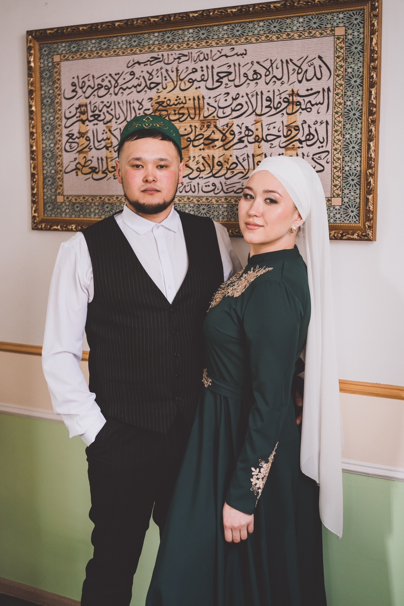
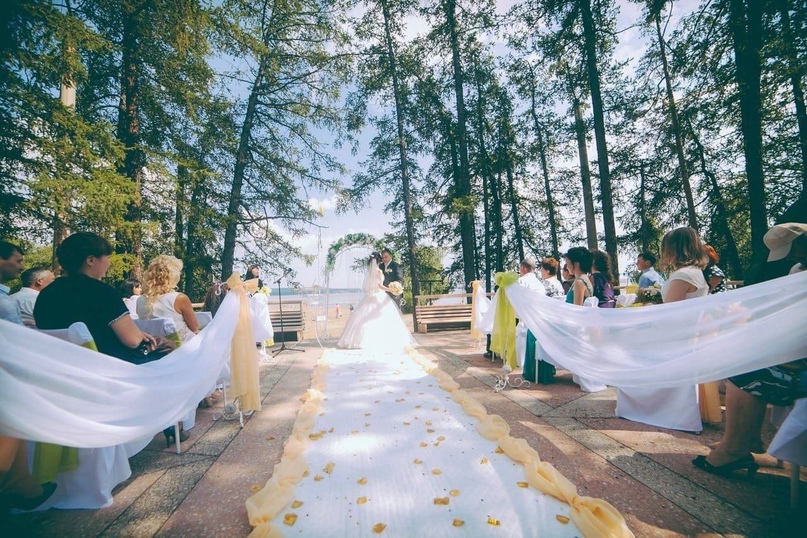
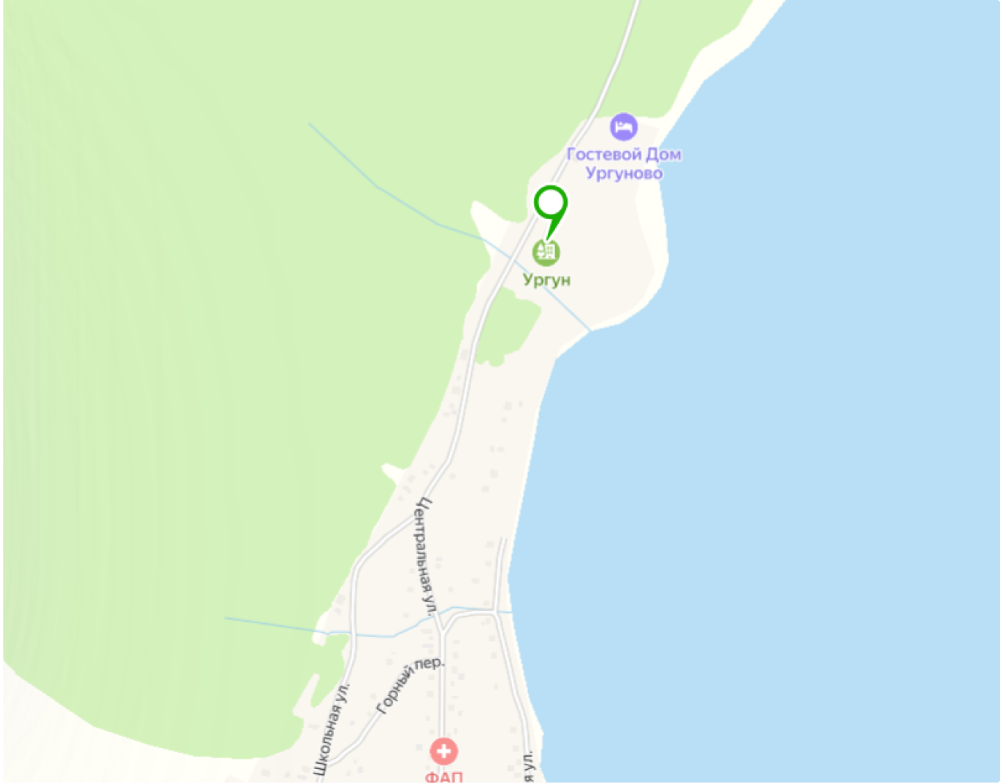
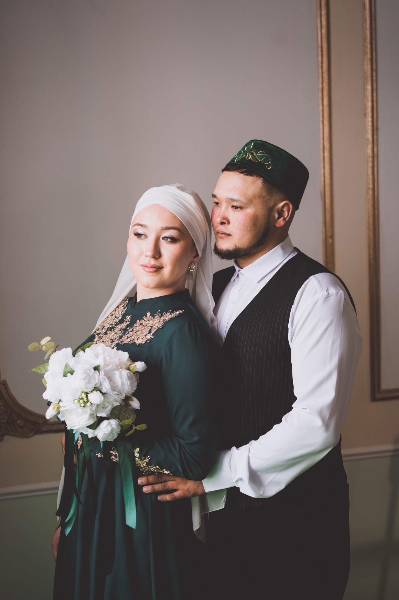

<!DOCTYPE html>
<html lang="ru">
  <head>
    <meta charset="UTF-8" />
    <meta name="viewport" content="width=device-width, initial-scale=1.0" />
    <title>Свадебное приглашение</title>
    <link rel="stylesheet" href="style.css" />
  </head>
  <body>
    <section class="section1">
      

      

      

      
Рады пригласить вас на нашу свадьбу!

      
02 августа 2025 года в 15:30

      

        Булат
        &amp;
        Гузель
      

      
      

      

        
      

      

    </section>

    <section class="section2">
      

      

        Дорогие родные и близкие! 
        С огромной радостью приглашаем вас 
        на самое главное событие 
        в нашей жизни – нашу свадьбу! 
        Мы будем ещё счастливей, если вы 
        разделите с нами этот чудесный день!
      

      <h2 class="section-title">Место проведения</h2>

      

        
      

      

        Туристический комплекс «Ургун» 
        улица Центральная 101
      

      

        
      

      <a
        href="https://yandex.ru/maps/?text=Туристический%20комплекс%20Ургун%20Центральная%20101"
        target="_blank"
        class="map-button"
      >
        Открыть карту
      </a>

      

    </section>

    <section class="section3">
      

      

        

          1
          

            Пожалуйста, не дарите нам 
            живые цветы, они прекрасны, 
            но недолговечны.
          

        

        

          2
          

            Если собираетесь подарить нам 
            ценный и нужный подарок – 
            поместите его в конверт.
          

        

        

          3
          

            Мы будем бесконечно 
            благодарны, если вы 
            разделите с нами счастливые 
            моменты, будничные 
            проблемы и дела подождут!
          

        

      

      

        
&#10094;

        

          
        

        
&#10095;

      

      

    </section>

    <section class="section4">
      

      <h2 class="section-title">Расписание</h2>

      

        

          13:30
          

            <h3>Выкуп невесты</h3>
            

              С весёлого старта начинается день! Жениху предстоит пройти
              несколько испытаний, чтобы доказать свою любовь. Обещаем: будет
              весело и с душой!
            

          

        

        

          15:30
          

            <h3>Сбор гостей</h3>
            

              Время встреч и улыбок! Перекинуться парой слов с друзьями, сделать
              пару фото и насладиться лёгкими закусками – отличный старт перед
              церемонией.
            

          

        

        

          16:00
          

            <h3>Выездная регистрация</h3>
            

              Тот самый трепетный момент! Слова любви, клятвы и счастливые глаза –
              всё это создаст магию, которую мы запомним навсегда.
            

          

        

        

          17:00
          

            <h3>Начало банкета</h3>
            

              Готовьтесь поднимать бокалы, наслаждаться вкусной едой и танцевать
              до упаду! Веселье официально объявляется открытым!
            

          

        

        

          23:00
          

            <h3>Заключение</h3>
            

              Пора обниматься на прощание, обмениваться тёплыми словами и
              загадывать желания. Спасибо, что были с нами в этот особенный день!
            

          

        

      

      

    </section>

    <section class="section5">
      <h2 class="section-title">Подтверждение присутствия</h2>

      

        Мы с нетерпением ждём встречи и хотим, чтобы всем было комфортно и
        радостно. Поделитесь с нами, сможете ли вы быть с нами в этот день — это
        правда важно для подготовки!
      

      <a
        class="confirm-button"
        href="https://forms.yandex.ru/u/example"
        target="_blank"
      >
        Форма подтверждения
      </a>

      

    </section>
  </body>
</html>
